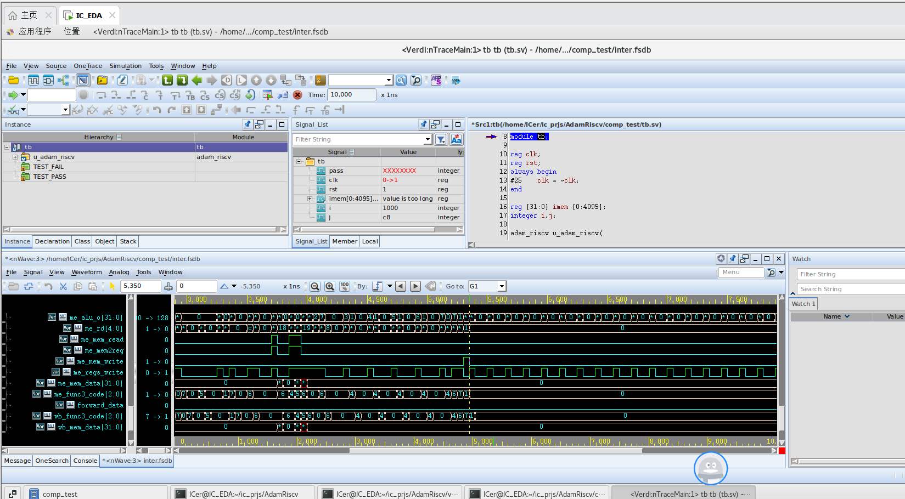
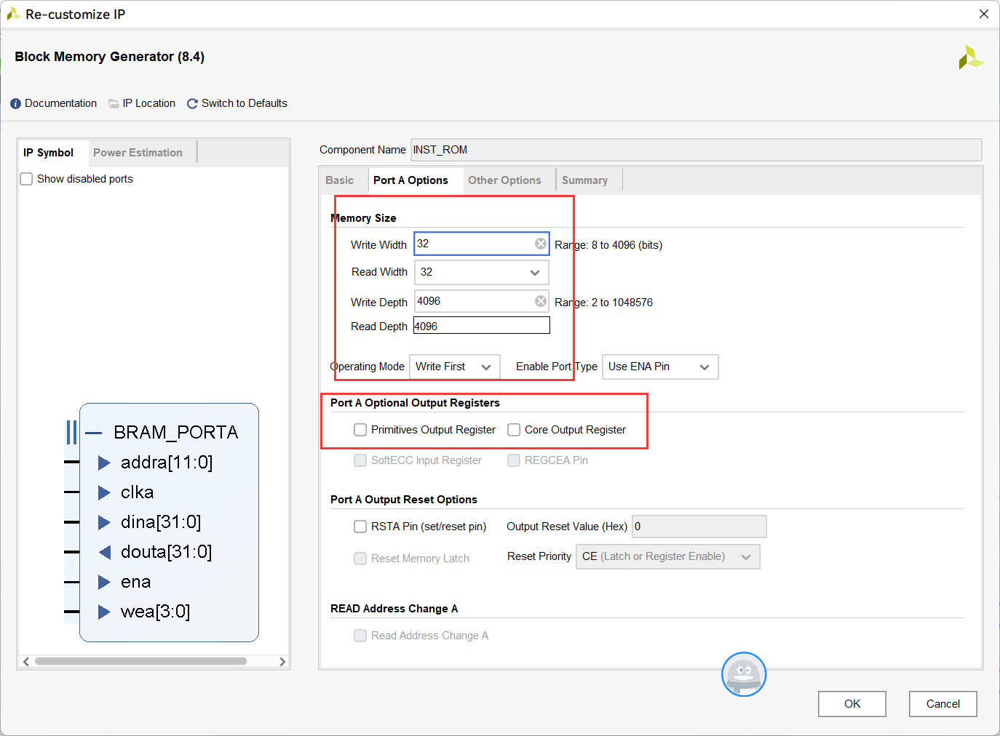

# RISC-V with Virtual Memory Access

本项目基于开源项目 **AdamRiscV** 进行开发，在RV32-I基础指令集的RICS-V处理器基础上进行改进以支持：

* M/S/U特权级转换
* 支持页表转换
* 支持系统寄存器访问

具体要求为：

* 额外的指令支持：csrw/csrr/mret/sret/ret
* 实现系统寄存器：mtvec/mtatus/mepc/mtval/satpsepc
* 页表转换：只支持数据访问的虚实转换，指令存储器访问仍然是实地址访问。

**AdamRiscV** 项目已经实现了兼容RV32I的标准五阶流水线CPU，主要参照《计算机组成与设计 硬件/软件接口 RISCV版》中的教程所设计。项目网址：
[AdamRiscV-Gitee](https://gitee.com/adam-wu1999/AdamRiscv);
[AdamRiscV-Github](https://github.com/AdamWu1999/AdamRiscv)

# 具体实现

## CSRs (Control and Status Registers) 

CSRs 一般都是在EX阶段访问

1. **`mtvec` (Machine Trap Vector Register):**
   - `mtvec` 确定机器模式陷阱向量的基址。此寄存器用于设置当发生陷阱或中断时控制转移到的地址。
   - `mtvec` 的地址为 0x305

2. **`mstatus` (Machine Status Register):**
   - `mstatus` 用于保存机器模式的各种状态和控制信息。
   - 地址为 0x300
   - 需要注意各个字段的意义：
   - `MPP` (Machine Previous Privilege): Specifies the privilege mode to enter upon an exception return.
   - `MPIE` (Machine Previous Interrupt Enable): Indicates whether interrupts were enabled before an exception occurred.
   - `MIE` (Machine Interrupt Enable): Indicates whether interrupts were enabled.

3. **`mepc` (Machine Exception Program Counter):**
   - `mepc` 存储发生陷阱或中断时的程序计数器值。当发生陷阱时，当前程序计数器的值保存在 `mepc`.
   - 地址为 0x341

4. **`mtval` (Machine Trap Value):**
   - `mtval` 保存有关某些异常的附加信息。例如，对于指令页错误异常，`mtval` 包含发生故障的虚拟地址。
   - 实现 `mtval` 涉及在发生某些异常时适当地更新它。需要为每种类型的异常确定要存储在 `mtval` 中的相关信息。
   - 地址为 0x343

5. **`medeleg & mideleg` (Machine Trap Delegation Registers)**
   - `medeleg` 控制 M 态的 `异常` 是否代理到 S 态，1 表示代理；
   - `medeleg` 控制 M 态的 `中断` 是否代理到 S 态，1 表示代理；
   - 对于 `异常` 一般默认不代理，在本项目实现中默认不代理，所以不实现这两个 CSRs；

6. **`mcause` (Machine Cause Register)**
   - 当发生异常进入 M 态时，`mcause` 被写入一个代码，该代码指示了导致异常的事件。
   - `mcause` 从来不是由自动写入的，它是由软件显式写入的。
   - 地址为 0x342 

7. **`satp` (Supervisor Address Translation and Protection):**
   - `satp` 对于在 S 模式下管理虚拟内存至关重要。它保存根物理页表地址。
   - 要将 `satp` 集成到MMU(内存管理单元)逻辑中。当进入 S 模式或在 S 模式下处理页面错误时，相应地更新 `satp` 。
   - 地址为 0x180

8. **`sepc` (Supervisor Exception Program Counter):**
   - 与 `mepc` 类似，`sepc`存储异常时的程序计数器值，但处于 S 模式。
   - 地址为 0x141

## 额外指令支持

1. **`csrr` & `csrw`**
   - `csrr` 读特定的CSR，是伪指令，实际上是通过 `csrrs` 来实现的。
   - `csrw` 对指定CSR的写入。作为一条伪指令，其实际上是通过 `csrrw` 来实现的。
   - 编码如下：其中csr是高12位，集合了funct7和rs2。

   ```assembly
   csrr rd,csr # pseudo
   csrrs rd, csr, x0

   csrw csr, rs1 # pseudo
   csrrw x0, csr, rs1
   ```

2. **`mret` (Machine-mode Return):**
   - 从 M 态的返回指令。
   - 按照 `mstatus` 的 `MPP` 返回到上一次特权级。
   - 从 `mepc` 中恢复PC。
   - 指令编码为 0x30200073

3. **`sret` (Supervisor-mode Return):**
   - 从 S 态的返回指令。
   - 按照 `sstatus` 的 `SPP` 返回到上一次特权级。
   - 从 `sepc` 中恢复PC。
   - 指令编码为 0x10200073，两者编码如下所示 

4. **`ret` (Return):**
   - 普通返回，伪指令，使用 `auipc` 和 `jalr` 实现

## MMU 设计

首先说明：我们只实现了data memory 的虚拟地址转换，所以 MMU 直接接在 `访存` 阶段，不使用 TLBs，使用两级页表转换，页大小为 4KB。

具体的实现方式参照下图：


MMU 需要支持 page_fault 的处理，首先进行检测，引出 `page_fault` 连线，
一旦检测到 `page_fault` 置1，自动 flush 访存阶段之前的所有状态，
在下一拍保留 pc 到 `mepc` 并设置执行阶段执行类似 `mret` 的指令，跳转到中断处理程序。

# 源项目使用手册

## 1 工程目录结构总览

- module：RTL设计文件与编译用file_list
    
    
- libs：SRAM库
    
    --MC_MACRO：由memory compiler导出的库，但功能仿真下暂不可用
    
    --REG_ARRAY：基于二维数组实现的手写单端同步读写SRAM
    
- verification：是修改自CK_Riscv项目的指令分类测试验证平台
    
    --cases：各类指令的测试用例目录，包含c程序、汇编程序、tb测试部分
    
    --regress_fun：Regress回归目录，包含编译、仿真的makefile与配置文件、路径指定文件
    
    --testbench：仿真所需额外文件（tb的另一部分）
    
- scripts：是运行指令分类测试验证平台所需的perl脚本包
    
    
- comp_test：是v1.0中的tb进一步完善而来的综合性测试验证平台，包含tb、makefile与所需脚本
    
    
- rom：综合性测试tb及FPGA模式所需的软件程序与对应golden，以及生成初始化固件所需的脚本
    
    
- fpga：包含开启FPGA模式的define声明、管脚约束文件、以及FPGA模式下的仿真tb
    
    

## 2 硬件设计简介

### 2.1 硬件架构图

硬件架构图如下（只显示主要模块与信号）：


### 2.2 相关指标

- 标准五阶流水线
- 顺序发射、顺序执行、顺序写回
- 哈佛架构
- 实现的特权态：M态
- 实现的指令：RV32I中除了控制状态寄存器指令、fence、ecall等杂项指令外的其余37条指令

    

- **不支持非对齐地址**
- 无分支预测，跳转发生后会flush流水站，产生两拍的空泡
- 含有前递通路，存在数据相关时，Load指令与其后的Store指令不需要停顿，Load指令与除Store外的指令仅需停顿1拍；Load指令外的其余指令之间存在数据相关时也无需停顿


## 3 指令分类测试TB

### 3.1 环境配置

需要****RISCV工具链、VCS、Verdi、perl。****

具体使用教程可参考，本使用手册仅对该平台补充一些我自己的理解。[CK_Riscv: 简易的RISC-V五级流水线标量处理器：CK_RISCV； 支持RV32I指令集，使用Veriog编写，简单易懂； 参照公司研发环境，设计一套规范的设计与验证环境； - Gitee.com](https://gitee.com/Core_Kingdom/CK_Riscv/tree/master#https://gitee.com/link?target=https%3A%2F%2Fblog.csdn.net%2Fweixin_40377195%2Farticle%2Fdetails%2F125345914%3Fspm%3D1001.2014.3001.5501)

也可以直接使用芯王国的虚拟机。

### 3.2 目录解析

- scripts：scripts中存放着众多可在终端中联动多个工具的perl脚本，如regress、openverdi。这些脚本需要在工程根目录下source bashrc.env，source完即可在这个终端中直接将这些脚本当命令调用。
    
    
    
- verification：其中包含了testbench、cases、regress_fun三个部分
    
    
    

### 3.3 魔改指南

- 设计的RTL目录下需要自行准备一个file_list并在其中写好该目录下要使用的所有文件名。
- 更改DUT后，需要检查并修改/cases下所有user.sv中的DUT层次结构、/regress_fun/module_list中的文件路径、environment.sv中的层次结构、/regress_fun/coverage.cfg中的结构层次以及instance文件中的DUT例化信息。
- 若设计中包含include时，需要在sim_config中调用vcs时加入+incdir选项以及相应的include文件检索目录的路径（使用相对路径的话要注意是以VCS工程目录为主目录），open_verdi中调用verdi时也要加入+incdir选项（可以加在file_list.f中）。

## 4 综合测试TB

### 4.1 环境配置

需要****RISCV工具链、VCS、Verdi、Python3。****

### 4.2 目录解析

- comp_test：是v1.0中的tb进一步完善而来的综合性测试验证平台，包含tb、makefile与所需脚本
    - makefile：包含编译命令COMP、执行仿真命令（分无GUI版RUN与Verdi版RUNV）。调用COMP后会自动先调用./load_list.py、./GoldenToTb.py、../rom/gen_hex.sh生成所需的文件，再启动VCS。
    - load_list.py：Python脚本，拷贝设计文件目录中的file_list里的信息，并添加+incdir+[路径]、+define [SRAM模式]、+libext+[SRAM路径]等相关编译选项，生成MAKE COMP中所需的module_list文件。
    - GoldenToTb.py：Python脚本，解析../rom/golden.txt文本，生成test_content.sv，即运行的软件所对应的测试用例。
    - tb.sv：tb主体，包含DUT例化、fsdb生成、程序写入IROM、结果显示等，其中include了测试用例文件test_content.sv。
- rom：包含综合测试平台中软件程序以及将程序转为memory初始化文件所需的脚本
    - gen_hex.sh：bash脚本，参数为要用的汇编程序文件名，调用RISCV工具链将汇编程序转为main_s.o、反编译文件main_s.dump、memory初始化文件main_s.verilog。
    - HexToCoe.py：Python脚本，在FPGA模式下使用。会将$readmemh() 所用的初始化文件main_s.verilog转为BRAM初始化用的Coe文件main_s_fpga.coe。
    - test2.S：汇编程序，是综合测试平台的默认程序，可测试37条指令的功能，并可测试指令之间存在数据相关的情况以及部分有符号数指令对负数的运行情况。在FPGA模式下，只有程序正确执行至last_test段才会点亮LED灯。
    - test1.S：汇编程序，简易版的测试程序，只测试10余条核心指令的运行情况。
    - golden.txt：所使用的汇编程序的最终运行结果。如需修改程序请记得按格式要求修改golden里的内容。

### 4.3 使用方法

打开终端，进入comp_test文件夹运行`make COMP`就会自动编译。


再运行`make RUN`即可仿真。终端中会打印硬件运行情况与测试结果。显示“PASS”即为测试通过，否则会显示“FAIL”字样。


若需开启Verdi，则在仿真的时候改用`make RUNV`即可。




## 5 FPGA模式

### 5.1 使用方法

除了导入硬件设计文件外还需进行以下步骤：

1. 添加./fpga/FPGA_MODE.vh文件并将其设置为Global include，以开启FPGA模式
2. 在IP Catalog中打开Clocking Wizard创建时钟IP，只需要in、out两个端口即可，确保部件名称与图中一致（clk_wiz_0）。输入的时钟频率根据自己的板卡来确定。输出的时钟频率不超过110Mhz（主要还是根据板卡自己调）。

    

3. 在IP Catalog中打开Block Memory Generator创建两个BRAM IP，分别命名为INST_ROM、DATA_RAM。两个BRAM设置的参数均如下：

    

    

    对于INST_ROM，还需要额外设置初始化选项。先运行./rom/HexToCoe.py生成Coe文件，再在下图选项中添加Coe文件路径。勾选Fill Remaining Memory Location 并填写0，将空余的memory用0填充。

    

4. 添加xdc约束文件，此文件需根据自己的板卡来编写
5. 添加./fpga/tb_fpga.v，可进行FPGA模式下的仿真。（该模式不会自动由golden生成测试用例）

---

# 参考项目推荐

1. [CK_Riscv: 简易的RISC-V五级流水线标量处理器：CK_RISCV； 支持RV32I指令集，使用Veriog编写，简单易懂； 参照公司研发环境，设计一套规范的设计与验证环境； - Gitee.com](https://gitee.com/Core_Kingdom/CK_Riscv/tree/master#https://gitee.com/link?target=https%3A%2F%2Fblog.csdn.net%2Fweixin_40377195%2Farticle%2Fdetails%2F125345914%3Fspm%3D1001.2014.3001.5501)
2. [tinyriscv: 一个从零开始写的极简、非常易懂的RISC-V处理器核。 (gitee.com)](https://gitee.com/liangkangnan/tinyriscv)